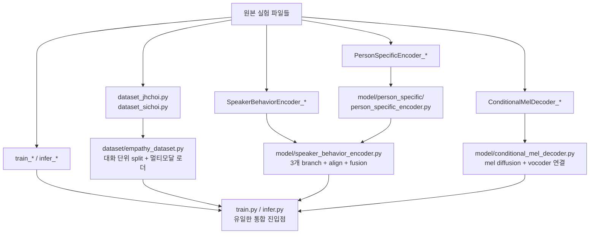
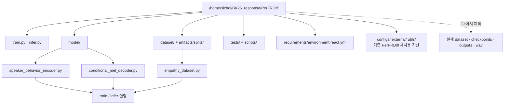
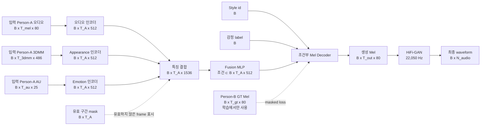
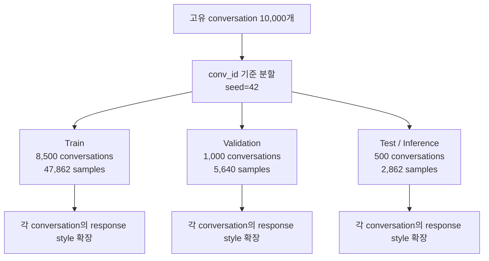

# NaviDiff 통합 멀티모달 오디오 응답 베이스라인

이 문서는 팀원이 처음 저장소를 열었을 때 현재 코드의 출처, 모델 흐름,
데이터 분할 방식, 실행 방법을 한 번에 이해할 수 있도록 작성한 한국어 안내서입니다.

현재 브랜치의 목적은 최종 연구 모델을 완성하는 것이 아니라, 1주차 목표인
기존 코드의 shape과 학습·추론 경로를 확인하고 재현 가능한 오디오 응답
베이스라인을 확보하는 것입니다.

## 1. 이 저장소는 어디서 왔는가


- 원본 PerFRDiff 구현은 기존 facial reaction 실험을 위해 보존했습니다.
- `jhchoi`와 `sichoi` 아래에서 나뉘어 있던 실험 내용을 공통 모듈로 합쳤습니다.
- 통합 코드에서는 사람 이름이 들어간 실행 파일과 중복 진입점을 사용하지 않습니다.
- 실제 데이터, checkpoint, 생성 음성, 발표용 이미지는 저장소에 넣지 않습니다.
- 이 문서와 발표 자료는 코드 저장소와 분리해 관리할 수 있습니다.

## 2. jhchoi와 sichoi 코드를 파일 단위로 통합한 방법

두 구현을 단순히 한쪽 파일로 덮어쓴 것이 아닙니다. 각 파일에서 실제
실행 경로에 필요한 연산과 shape 계약을 확인한 뒤, 중복된 사람별 복사본과
실험용 진입점을 제거하고 하나의 이름 없는 모듈로 정리했습니다.



| 원본 파일/폴더 | 최종 파일 | 취한 정보와 남긴 연산 | 버린 정보와 이유 |
|---|---|---|---|
| `dataset/dataset_jhchoi.py`<br/>`dataset/dataset_sichoi.py` | `dataset/empathy_dataset.py` | JSON의 `conv_id`, 입력 mel/MFCC/3DMM/AU, 6개 style 응답, gender/emotion 파일명 규칙, 가변 길이 padding | 두 구현의 response 단위 무작위 분할은 conversation leakage를 만들 수 있어 제거하고 `conv_id` 선분할로 교체 |
| `model/SpeakerBehaviorEncoder_jhchoi.py`<br/>`model/SpeakerBehaviorEncoder_sichoi.py` | `model/speaker_behavior_encoder.py` | mel `80D`, 3DMM `486D`, AU `25D`를 각각 `512D`로 투영하고, 유효 길이 정규화·시간 resample·mask·`1536D → 512D` fusion을 수행 | 사람 이름 import, 중복 checkpoint 경로, 서로 다른 로깅/실험용 wrapper를 제거 |
| `model/ConditionalMelDecoder_jhchoi.py`<br/>`model/ConditionalMelDecoder_sichoi.py` | `model/conditional_mel_decoder.py` | 조건부 mel diffusion loss, DDIM sampling, CFG, style/emotion embedding, `80D` mel 출력, 긴 sequence를 위한 sinusoidal position encoding 보정 | 사용하지 않는 listener/past-emotion 경로와 중복된 decoder 설정/진입점을 통합 경로에서 제외 |
| `model/person_specific/PersonSpecificEncoder_jhchoi.py`<br/>`PersonSpecificEncoder_sichoi.py` | `model/person_specific/person_specific_encoder.py` | Transformer backbone, positional embedding, 3DMM sequence 처리, `486D` 입력 projection | 이름별 동일 모듈 복사본을 제거하고 하나의 canonical class로 통일 |
| `train_jhchoi.py`<br/>`train_sichoi.py` | `train.py` | Stage-1 alignment, Stage-2 본 학습, validation, resume, checkpoint 저장, CUDA/DataParallel 옵션 | 실험별 절대 경로, 중복 CLI, 개인 로그 폴더와 임시 GT 실험 분기 제거 |
| `infer_jhchoi.py`<br/>`infer_sichoi.py` | `infer.py` | test split 입력 → encoder/fusion → mel decoder → HiFi-GAN waveform, checkpoint key 검증 | GT mel을 입력으로 넣어 동작만 확인하는 경로와 개인별 출력 폴더 분기 제거 |
| `test_sbe_*`, 개인 log/실험 문서 | `tests/` | 재현 가능한 shape 계약 및 split leakage 검증 | 실행 결과 로그, 발표용 이미지, 개인 메모는 코드 저장소에서 제외 |

### 최종적으로 남는 계산 경로

```text
Person-A mel [B,T,80]
      └─ Linear + LayerNorm ───────────────┐
Person-A 3DMM [B,T,486]
      └─ Person Transformer ──────────────┤
Person-A AU [B,T,25]
      └─ Emotion encoder ─────────────────┘
             ↓ 각 sample 유효 길이에 맞춘 resample + mask
      concat [B,T_A,1536]
             ↓ Fusion MLP
      condition c [B,T_A,512]
             + style/emotion embedding [B,512]
             ↓ Conditional Mel Diffusion
      generated mel [B,T_out,80]
             ↓ HiFi-GAN
      waveform [B,N_audio]
```

즉, 최종 모델에는 “누가 작성한 코드인가”가 아니라 입력 modality → 시간 정렬
→ 특징 결합 → mel 생성 → waveform 복원이라는 연산만 남겼습니다. Stage-1의
MFCC teacher `[B,T,78] → [B,512]`는 alignment 용도로만 남아 있고, 최종
추론 출력 경로의 입력은 아닙니다.

## 3. 통합 저장소의 root 구조

실제 clone 기준 root는 다음과 같습니다.

```text
/home/sichoi/BK26_response/PerFRDiff/
│
├── train.py                         ← 통합 학습 진입점
├── infer.py                         ← 통합 추론 진입점
├── README.md                        ← 원본 PerFRDiff 문서
├── README_navidiff.md               ← 이 통합 설명서
│
├── dataset/
│   ├── empathy_dataset.py           ← canonical 멀티모달 dataset
│   └── (기존 PerFRDiff dataset)     ← 기존 facial baseline 보존
│
├── model/
│   ├── speaker_behavior_encoder.py  ← canonical SBE
│   ├── conditional_mel_decoder.py   ← canonical mel decoder
│   ├── person_specific/
│   │   └── person_specific_encoder.py
│   └── (기존 diffusion/audio 모듈)  ← 재사용되는 기반 연산
│
├── scripts/
│   └── build_split_manifest.py      ← conv_id split 생성
├── artifacts/splits/
│   └── conv_id_seed42.json          ← 작은 재현용 manifest
├── tests/                           ← 통합 계약 테스트
├── requirements/
│   └── environment.react.yml        ← React CUDA 환경
├── configs/, external/, utils/      ← 기존 PerFRDiff 기반 자산
└── outputs/, checkpoints/, dataset/ ← Git 제외; 실행 시 외부에 둠
```



## 4. 현재 통합 모델의 전체 흐름



### Shape 요약

| 위치 | Shape | 의미 |
|---|---:|---|
| Person-A log-mel | `[B, T_mel, 80]` | 입력 오디오의 mel 특징 |
| Person-A 3DMM | `[B, T_3dmm, 486]` | 얼굴 움직임/appearance 특징 |
| Person-A AU | `[B, T_au, 25]` | 표정 및 affect 특징 |
| 각 인코더 출력 | `[B, T_A, 512]` | 25 Hz 기준 시간 정렬 후 특징 |
| 결합 입력 | `[B, T_A, 1536]` | 오디오·3DMM·AU 연결 |
| Fusion 출력 | `[B, T_A, 512]` | Mel decoder 조건 |
| 생성 Mel | `[B, T_out, 80]` | vocoder 입력 |
| 생성 waveform | `[B, N_audio]` | 최종 오디오 응답 |

`T_A`는 한 sample 안에서 세 입력 modality가 공통으로 유효한 시간 길이입니다.
현재 decoder는 조건 특징을 사용하지만 `c_mask`를 attention의 key-padding mask로
직접 전달하지는 않습니다. Person-B GT 오디오는 학습 loss와 평가 비교에만
사용하며, 추론 중 생성 길이를 결정하는 데 사용하지 않습니다.

## 5. 데이터 분할과 leakage 방지

한 conversation에서 최대 6개의 response style이 나오므로, style 단위로
무작위 분할하면 같은 conversation이 train과 test에 동시에 들어갈 수 있습니다.
현재는 conversation ID를 먼저 나눈 뒤 각 split 안에서 style sample을 확장합니다.



분할 manifest는 다음 위치에 있습니다.

```text
artifacts/splits/conv_id_seed42.json
```

검증 결과 train/validation/test 사이의 `conv_id` 교집합은 0개입니다.
`train.py`는 train/validation을 사용하고, `infer.py`는 기본적으로 test split을
사용합니다.

기존 `train_diffusion.py`, `train_rewrite_weight.py`, `evaluate_*.py` 등은
원래 PerFRDiff 실험을 위해 남겨져 있습니다. 새 오디오 baseline의 진입점은
`train.py`와 `infer.py`입니다.

## 6. 환경 설치

검증된 React 환경을 사용합니다.

```bash
conda env create -f requirements/environment.react.yml
conda activate react
```

기존 `requirements.txt`는 오래된 파일이라는 이유만으로 삭제하지 않았습니다.
기존 PerFRDiff 실행 코드가 사용할 수 있으므로, 새 baseline 환경 파일과 별도로
보존합니다.

## 7. 테스트와 실행

먼저 shape 계약과 split leakage 테스트를 실행합니다.

```bash
python -m unittest discover -s tests -v
```

필요하면 manifest를 다시 생성할 수 있습니다.

```bash
python scripts/build_split_manifest.py \
  --output artifacts/splits/conv_id_seed42.json
```

학습과 추론 옵션은 다음으로 확인합니다.

```bash
python train.py --help
python infer.py --help
```

추론 checkpoint가 없으면 코드가 명시적으로 오류를 내도록 되어 있습니다.
checkpoint 없이 임의의 untrained 음성을 생성하지 않습니다.

다음 파일은 Git에 넣지 않습니다.

```text
/mnt/HDD1/bk_dataset/
checkpoints/
outputs/
*.pth, *.pt, *.ckpt
생성된 wav/mel 파일
```

## 8. 현재까지 검증한 항목

- 통합된 speaker behavior encoder shape 계약
- 486D 3DMM 입력 projection과 시간 정렬
- conversation-level split 및 leakage 검사
- Stage 1 CUDA 학습 smoke test
- Stage 2 checkpoint resume smoke test
- checkpoint를 사용한 CUDA 추론 및 HiFi-GAN wav 생성

## 9. 아직 최종 목표가 아닌 항목

현재 branch는 Week-1 baseline입니다. 다음 연구 항목은 아직 별도 구현이
필요합니다.

- response length prediction
- semantic response planning
- affect transport
- neural codec 기반 flow matching
- 6개 style 중 어떤 GT response를 선택할지에 대한 명시적 매핑 정책

따라서 이 branch의 목적은 최종 모델의 모든 기능을 주장하는 것이 아니라,
현재 baseline의 입력·출력 shape과 학습·추론 경로를 팀 전체가 재현할 수 있게
만드는 것입니다.

## 10. 개인 fork에서 PR 만들기

이 작업의 PR 대상은 원본 `JihoonCh/2026BK`가 아니라 개인 fork인
`in3der/2026BK`입니다. 팀원이 개인 fork에 초대되어 있다면 그 fork 안의
PR을 확인하고 리뷰할 수 있습니다.

```bash
git add README_navidiff.md
git commit -m "docs: add Korean NaviDiff integration guide"
git push origin team1/integrated-baseline
```

GitHub CLI로 개인 fork의 `main`에 PR을 만들려면:

```bash
gh pr create \
  --repo in3der/2026BK \
  --base main \
  --head team1/integrated-baseline \
  --title "docs: add Korean NaviDiff integration guide" \
  --body "통합 멀티모달 오디오 baseline의 히스토리, 모델 shape, 데이터 분할, 실행 방법을 한국어로 정리했습니다."
```

이미 같은 branch에서 열린 PR이 있다면 새 PR을 만들 필요 없이 push만 하면
기존 PR에 변경사항이 자동으로 반영됩니다.
